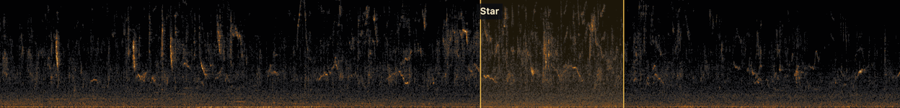
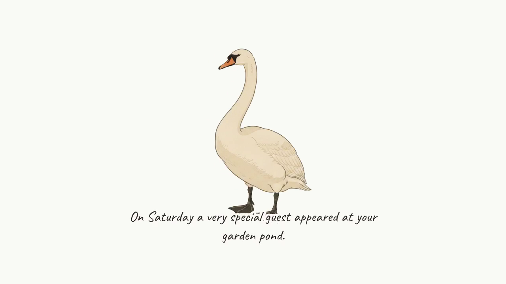

# vogel-werkzeuge

**Your garden narrates its own week.**

A microphone on a Raspberry Pi listens all day. Every Sunday evening a
narrated film arrives that tells what it heard — who called most, who turned
up for the first time, where the migrants are heading. In between, a live
spectrogram shows the garden as it sings, and every bird is marked the moment
it is recognised.

This is built on other people's work: bird recognition by
**[BirdNET](https://birdnet.cornell.edu)** (Cornell Lab of Ornithology and
TU Chemnitz), the station software by
**[BirdNET-Pi](https://github.com/Nachtzuster/BirdNET-Pi)** (Patrick McGuire,
kept alive by Nachtzuster), and the collage and the bird illustrations you
see below by **[AvianVisitors](https://github.com/Twarner491/AvianVisitors)**
(Teddy Warner). The tools here sit beside all of it and add nothing to the
recognition itself.


*From the weekly recap. The script is written from the week's detections,
spoken by [Piper](https://github.com/rhasspy/piper), assembled with ffmpeg,
all from a timer. A full episode with English subtitles is in
[`beispiele/`](beispiele/).*



*The live view, captured from the running system: the band scrolls with the
microphone, 22 seconds behind real time; a detection is drawn onto it the
moment BirdNET reports it, and the clip plays at that exact spot once it has
reached the server.*

**And the website never touches the Pi to do it.** A live view usually means
opening a hole into the home network, or proxying an audio stream out of it.
Here the Pi asks a mailbox on the public server every few seconds whether
anyone is watching, and only then pushes spectrogram strips and clips into
it. Traffic goes one way, outward, over a tunnel the Pi itself opens. There
is no inbound port, no forwarded stream, and nothing on the internet can
reach the microphone — see [the mailbox](server/briefkasten/) and
[`vogel-rueckweg.service`](pi/vogel-rueckweg.service).



*Illustration from the AvianVisitors set, CC BY-NC-SA 4.0 — see
[`beispiele/README.md`](beispiele/README.md) for what that means for the
sample videos.*

---

Tools that grew around a [BirdNET-Pi](https://github.com/Nachtzuster/BirdNET-Pi) /
[AvianVisitors](https://github.com/Twarner491/AvianVisitors) garden install:
a live spectrogram feed, narrated weekly and monthly video recaps, per-species
portrait videos, a push-only link between the Pi and a public server, a network
watchdog, and automatic illustration backfill.

None of this modifies BirdNET-Pi or AvianVisitors. Everything here reads the
detections database and the extraction folder that BirdNET-Pi already produces,
and writes its own output beside them. That is why it lives in its own
repository under its own licence — see [NOTICE.md](NOTICE.md) for the
boundaries.

The code is commented in German. The setup notes below are in English so the
BirdNET-Pi community can use them; a German walkthrough is planned.

Running daily since August 2026 on a Raspberry Pi 4 (Bookworm, headless, USB
microphone) plus a small VPS. About 10 000 detections and 58 species at the
time of writing.

## What is in here

```
pi/               runs on the Raspberry Pi next to BirdNET-Pi
server/           runs on a public server the Pi pushes to
bereitstellung/   provisioning: flashing the SD card, hardening the server, Caddy
beispiele/        a real weekly episode, German and English subtitles
doku/             the images used above
```

### On the Pi (`pi/`)

| file | what it does |
|---|---|
| `avian_uplink.py` + `avian-uplink.service` | reads `birds.db` read-only every 60 s and pushes new detections to the server; survives outages, never loses a detection, standard library only |
| `live_dienst.py` + `vogel-live.service` | the live feed: draws the microphone signal as a continuous spectrogram band (WebP strips, absolute dB scale so strips join seamlessly), marks every detection on it, pushes strips and clips to the server's mailbox |
| `daten_hochladen.sh` + `vogel-upload*.timer` | rsyncs the database every ~90 s and the recordings every ~10 min, with `flock` so the two never overlap |
| `netzwacht.sh` + `vogel-netzwacht.timer` | watchdog: escalates from Wi-Fi reconnect to NetworkManager restart to reboot when the server is unreachable — but only if the home network itself is up, so a dead server never reboots a healthy Pi |
| `temperatur_waechter.sh` + `vogel-temperatur.service` | shuts the Pi down at 75 °C, warns the website at 70 °C |
| `vogel-rueckweg.service` | the only SSH link between Pi and server — a reverse tunnel the Pi opens, so nothing on the internet ever connects *into* the home network |

### On the server (`server/`)

| folder | what it does |
|---|---|
| `briefkasten/` | the mailbox: a small HTTP service on localhost that the Pi pushes live strips, state and clips into, and that the web frontend reads from. The frontend never reaches the Pi. |
| `eigenes/live.*` | the live view — band, marks, drag-to-scrub, species card, gallery |
| `wochenschau/` | weekly, monthly and per-species videos: script from the data → narration with [Piper](https://github.com/rhasspy/piper) (CC0 German voices) → assembled with ffmpeg. No paid service in the chain. |
| `push/` | Web Push and native app notifications: new species, or every detection |
| `vogelbilder-nachziehen.py` + `vogel-vogelbild.*` | when a species is heard for the first time, its illustration is generated within minutes — triggered by the database sync via a systemd path unit, with a 4-hourly timer as safety net |
| `eigenes/bild_rendern.py` | renders the last 24 hours as a calm PNG collage for an e-ink lock screen or a screensaver |
| `oeffentlich/` | the endpoints the mobile apps and the collage read |

### Provisioning (`bereitstellung/`)

`flash-sd.sh` writes a card with Wi-Fi and SSH preconfigured; `setup-pi.sh`
checks the microphone, fixes the ALSA device name, disables the conflicting
live stream and installs the uplink; `harden-server.sh` and the Caddyfiles set
up the server behind a login gate with a strict PHP allowlist.

Hostnames, addresses and site names in these files are placeholders
(`example.org`, `203.0.113.10`). Replace them with your own.

## Things worth knowing before you copy any of it

- **The Pi pushes; nothing pulls from it.** The server has no route into the
  home network. If you change that, you change the security model.
- **Secrets never go on a command line.** They are read from files and handed
  to subprocesses through the environment, so they never appear in the process
  list or the journal. Keep it that way.
- **`birds.db` is opened read-only everywhere.** BirdNET-Pi owns it.
- The illustration generator reuses `generate_one.py` from AvianVisitors. It
  registers masks only after *both* poses succeed; if the second fails, the
  first is left invisible. `vogelbilder-nachziehen.py` repairs that after every
  failed run — see the comment in `silhouetten_nachtragen()`.

## Licence

AGPL-3.0 — see [LICENSE](LICENSE). Use it, change it, run it as a service; if
you distribute it or offer it over a network, share your changes under the same
terms. The boundary to the CC BY-NC-SA material it works alongside is spelled
out in [NOTICE.md](NOTICE.md).

## Thanks

None of this would exist on its own.

**[BirdNET](https://birdnet.cornell.edu)** — K. Lisa Yang Center for
Conservation Bioacoustics at the Cornell Lab of Ornithology, with TU
Chemnitz. The recognition itself, given away for research and private use.

**[BirdNET-Pi](https://github.com/Nachtzuster/BirdNET-Pi)** — Patrick
McGuire built it, and **Nachtzuster** has kept it running through years of
new Raspberry Pi OS releases. Everything here reads a database that their
software fills.

**[AvianVisitors](https://github.com/Twarner491/AvianVisitors)** — Teddy
Warner. The collage, the atlas, the illustrations, and the taste in the
details. It is what made a pair of friends start caring about the birds
outside their window, which was the entire point; the live band and the
videos are only an extension of an idea that was already good.

**[Piper](https://github.com/rhasspy/piper)** — Rhasspy, and **Thorsten
Müller**, who recorded his voice and released it as CC0 so that a garden in
Germany can narrate its own week without anyone paying for speech.

And to everyone who has published a regional illustration bundle in
AvianVisitors' [`illustration-bundles.md`](https://github.com/Twarner491/AvianVisitors/blob/avian-visitors/illustration-bundles.md)
— this station runs on the Dutch set by
[peterdeboer-nl](https://github.com/peterdeboer-nl/AvianVisitors), which
covered almost every European species heard here.
